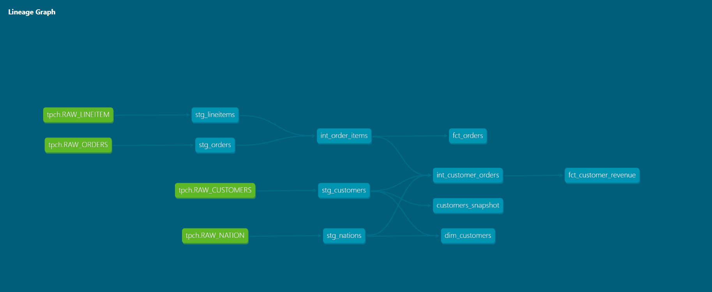
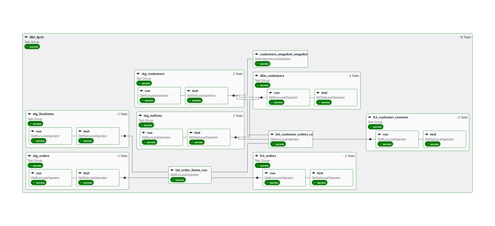

# Snowflake dbt Airflow Pipeline

An end-to-end data engineering portfolio project that builds a production-style ELT pipeline using Snowflake, dbt Core, and Apache Airflow orchestrated with Astronomer Cosmos.

## Architecture

Raw Data (Snowflake) → dbt Staging → dbt Intermediate → dbt Marts → Airflow Orchestration

## Tech Stack

| Tool | Purpose |
|------|---------|
| Snowflake | Cloud data warehouse |
| dbt Core | Data transformation |
| Apache Airflow | Pipeline orchestration |
| Astronomer Cosmos | dbt + Airflow integration |
| Docker | Local Airflow environment |
| GitHub | Version control |

## Dataset

TPC-H benchmark dataset (~6M rows) containing orders, customers, lineitems and nations data — a standard dataset used to simulate retail business data.

## Project Structure

├── dbt/tpch_pipeline/
│   ├── models/
│   │   ├── staging/        # Raw source cleaning
│   │   ├── intermediate/   # Business logic joins
│   │   └── marts/          # Final fact and dimension tables
│   ├── snapshots/          # SCD Type 2 on customers
│   ├── analyses/           # Ad-hoc business queries
│   └── macros/             # Reusable Jinja macros
└── airflow/
├── dags/               # Airflow DAG definitions
└── include/dbt/        # dbt project for Cosmos

## dbt Features

- 9 models across 3 layers (staging, intermediate, marts)
- 35 data quality tests
- Incremental materialization on `fct_orders` (4.5M+ rows)
- SCD Type 2 snapshot on customers
- Surrogate keys using `dbt_utils`
- Custom macro (`cents_to_dollars`)
- Post-hook to auto-grant SELECT to REPORTER role
- Monthly revenue trend analysis
- Sales Dashboard exposure

## dbt Lineage Graph



## Airflow DAG

Orchestrated using Astronomer Cosmos — automatically generates one Airflow task per dbt model with correct dependency ordering.



## How to Run

### dbt

```bash
# Install dependencies
pip install dbt-snowflake

# Run all models
dbt run --project-dir dbt/tpch_pipeline

# Run tests
dbt test --project-dir dbt/tpch_pipeline
```

### Airflow

```bash
# Start Airflow locally
cd airflow
astro dev start

# Open Airflow UI
http://localhost:8080
```

## Author

Dinesh A — Data Engineer
[LinkedIn](https://www.linkedin.com/in/dinesh-a-128931238/)
